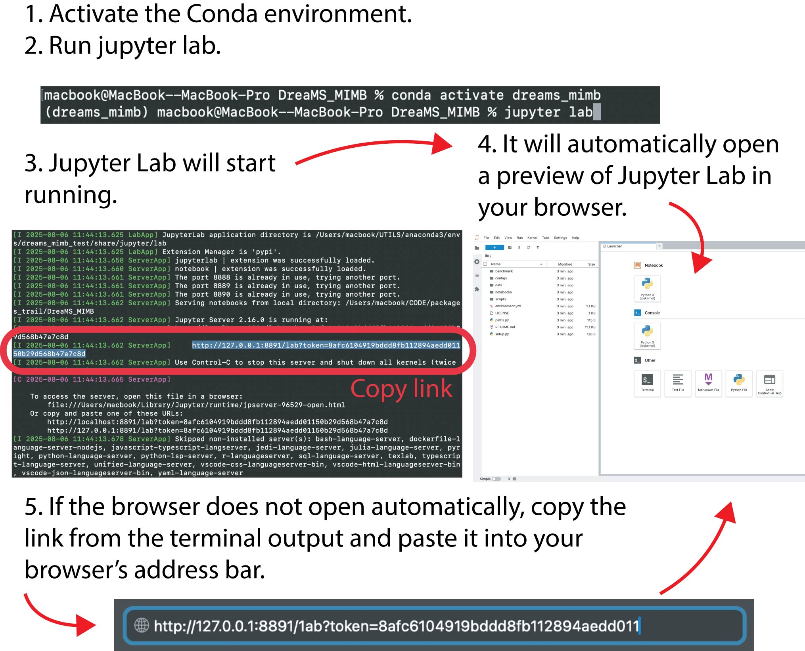

# DreaMS_MIMB

This repository is the hands-on companion to the book chapter *Using Foundational Models for Mass Spectrometry*. It includes ready-to-run Jupyter notebooks, datasets, and pretrained models for [DreaMS](https://www.nature.com/articles/s41587-025-02663-3) and [MassSpecGym](https://arxiv.org/abs/2410.23326). You can follow the complete workflow, from preparing and deduplicating spectra to matching them in spectral libraries and fine-tuning models. The tutorials match the chapter’s examples and are easy to follow for both beginners and experienced researchers. Everything comes with installation scripts so you can set up the environment quickly and adapt the methods to your own data.

---

## 🚀 What is DreaMS_MIMB?

- **DreaMS_MIMB** is a collection of logical, stepwise tutorials (Jupyter Notebooks) to teach you:
  - How to prepare mass spectrometry data
  - Deduplicate and match spectral libraries
  - Train and fine-tune the DreaMS model for your own data
  - Investigate and interpret predictions

**No prior experience with machine learning or mass spectrometry required!**

---

<h2 id="project-structure">🗂️ Project Structure</h2>

```
DreaMS_MIMB/
│
├── notebooks/
│    ├── 0_notebook_tutorial.ipynb        # Start here: understanding work with notebooks and data
│    ├── 1_data_preparation.ipynb         # Loading and understanding MSData objects
│    ├── 2_deduplication.ipynb            # How to deduplicate spectra
│    ├── 3_library_matching.ipynb         # Match data to spectral libraries
TODO LOWER NOT PREPARED YET
│    ├── 4_1_DreaMS_focal_loss.ipynb      # Learn about focal loss in DreaMS
│    ├── 4_DreaMS_finetuning.ipynb        # Fine-tune the DreaMS model
│    ├── 5_prediction_investigation.ipynb # Dive into predictions and their meaning
│
├── environment.yml    # Reproducible setup for Conda
├── benchmark          # All main code and packages used in the tutorials
├── paths.py           # Unified project paths for all code
├── data/              # Where your data files go (see notebooks for instructions)
├── README.md          # You are here!
```

---


<h2 id="step1">🛠️ Step 1: Prerequisites</h2>

> ⚠️ **Experienced user?**  
> You can skip directly to the [Minimal setup commands](#quick-setup).

Before you start, make sure you have:
- **Anaconda / Miniconda installed**  
  (Recommended: Miniconda for minimal install; both Windows, Mac, and Linux are supported.)
- **Conda** is a tool that helps you install all the software and libraries needed for this project with a single command, and keeps them separated from other programs on your computer.

If you don’t have Conda yet:
1. Download Miniconda from [here](https://docs.conda.io/en/latest/miniconda.html)
2. Follow the official install instructions for your operating system


**How to check if Conda is installed**

Open your terminal (or Anaconda Prompt on Windows) and type:

```bash
conda --version
```

If you see a version number (like `conda 23.3.1`), you’re ready!  
If you see an error, install Miniconda first.

---

## 📦 Step 2: Get the code

1. Open your terminal  
   - On Windows: Open the Anaconda Prompt from the Start Menu (search for “Anaconda Prompt” and click it).  
     **TODO:** Add screenshot of opening Anaconda Prompt  
   - On macOS/Linux: Open your Terminal application from the Applications folder or system menu.
2. Navigate to the folder where you want this project. For example, to use your Documents folder:

    ```bash
    cd Documents
    ```

3. Download (clone) the project code from GitHub:

    Type these commands in the terminal:
    
    ```bash
    git clone https://github.com/pluskal-lab/DreaMS_MIMB.git
    cd DreaMS_MIMB
    ```
   This downloads all the files and code you will need for the tutorial into a folder called DreaMS_MIMB.
   
	(You only need to do this once. You’ll always run everything from inside this folder.)

### 💡 **If you don’t have Git installed**

You can get the code just as easily! This method does the same thing as the `git clone` command, just with a few extra clicks.

1. Go to the project’s GitHub page:  
   [https://github.com/Jozefov/DreaMS_MIMB](https://github.com/Jozefov/DreaMS_MIMB)

2. Click the green **“Code”** button, then click **“Download ZIP”**.

3. Unzip (extract) the folder to the location you want on your computer
   - for example, your **Documents** folder.  
      This will create a folder named `DreaMS_MIMB` containing all the code and resources you need.

4. Open your terminal, and *change directory* (terminal command `cd`) into that folder.  
   If you put it in Documents:

    ```bash
    cd DreaMS_MIMB
    ```

   *(If your folder is in a different place, use that path instead.)*

---

**What’s happening in this step?**  
You are simply downloading all the resources and code needed for this tutorial.

*Don’t worry, using the ZIP file is just as good as using Git!*

---

<h2 id="step3">🧪 Step 3: Setup Your Environment (Windows, macOS, Linux)</h2>

**Confirm Conda is working**

**First, make sure you’re using the terminal in the same folder as the previous step (the DreaMS_MIMB folder)**. If you closed your terminal, just open a new one and use `cd` to enter your project folder again.

To check that Conda is installed and working, type:
```bash
conda --version
```

If you see the version number, proceed! If not, [go back to Step 1](#step1).

1. **Install all packages and set up the environment**  
   Instead of manually creating an environment from `environment.yml`, we provide a script that installs all dependencies, resolves conflicts, and prepares the correct environment automatically.

    ```bash
    bash scripts/install_env.sh
    ```
   This command creates a Conda environment named `dreams_mimb`, install all required Python packages.
2. **Activate the environment**
	
	Next, activate your new workspace with:
    ```bash
    conda activate dreams_mimb
    ```
	**What does “activate” mean?**
	- By “activating” the environment, you make sure that any commands you run will use the correct versions of Python and all necessary libraries, without interfering with other projects or programs on your computer.
    - You’ll need to activate this environment every time you open a new terminal and want to work on this project.

    If you see errors about “conda command not found,” make sure you have Conda installed and restart your terminal.

3. **Download the data assets**

   We provide a script to fetch all necessary datasets and place them in the correct directories:
    ```bash
    python scripts/download_assets.py
    ```
   - After this step, your data/ folder will contain all resources needed for the tutorials.

---

## 📓 Step 4: Start Jupyter Notebooks

To work with this project, you **must** use Jupyter Notebooks.
Jupyter lets you run small pieces of code (called “cells”), see the results instantly, and mix code with explanations, all in your web browser.

**(A) Recommended: JupyterLab**

In your terminal (make sure your environment is activated), type:

```bash
jupyter lab
```

- After a few seconds, your default web browser will open automatically.
If not, copy and paste the link from your terminal into your browser.


<p align="center">
  
</p>


- You’ll see a file browser, navigate into the notebooks folder on the left side.
- Start with `1_data_preparation.ipynb` and proceed step by step.

**(B) Classic Jupyter notebook (if you prefer):**

```bash
jupyter notebook
```

- Type this command in your terminal (just like before).
- This will also open a new tab in your browser, but with a simpler interface.
- Find and open the notebooks folder, then open the first notebook.

  **TODO:** Add screenshot or note where this command is run: always in the terminal!

>  **Tip:**  
> Both JupyterLab and the classic notebook work the same way for this tutorial, choose the one you like best!  
> Just remember:  
> - You **always** run `jupyter lab` or `jupyter notebook` **in your terminal** (not in a Python console or elsewhere).  
> - **Always** make sure you have activated your Conda environment before starting ([see Step 3](#step3)).

---

## 📚 Step 5: Follow the Tutorials

Once your environment is set up, you're ready to explore the project through interactive Jupyter notebooks.

### 🔢 Notebook Order

- Navigate to the `notebooks` folder in the project directory.
- Start with the first notebook: [`1_data_preparation.ipynb`](#project-structure)  
(You can learn more about the project layout [here](#project-structure).)
- The notebooks are numbered in the order you should follow.
- Each notebook builds on the previous one, it's important to follow them sequentially.

### How to Use Jupyter Notebooks

Jupyter notebooks are interactive documents that combine code, text, and visualizations. Here's how to work with them:

- Notebooks are made up of “cells”, either code or explanatory text.
- Run one cell at a time:
  - Click on a cell to select it.
  - Press `Shift + Enter` to run the cell and move to the next one.
- **Always run notebooks from top to bottom**, step by step.
  - If you skip cells, later parts may not work correctly.
  - Restarting the kernel resets the notebook’s memory, you'll need to re-run all previous cells.

> **Tip:** If you're new to Jupyter, check the top menu for a ▶️ **Run** button, it's a quick way to execute the selected cell.


- **TODO:** Add screenshot of notebook with cells, and highlight the Run button

---

## 🧩 Troubleshooting

- If you run into issues:

  - **Check the Issues tab on GitHub**  
    Visit the Issues section of our GitHub page.  
    If your problem isn’t already answered there, you can create a new issue by clicking the **“New Issue”** button and describing your problem (including any error messages).

  - **Check for common problems**  
    See the **“Notes”** section in our book chapter, where we list the most common pitfalls and solutions.

- **Still stuck?**  
  If you don’t find an answer in the Notes section or we haven’t responded on GitHub, you can also use large language models (like ChatGPT or GitHub Copilot).  
  Just paste your error message and the code you’re struggling with. Often, these tools can help you quickly find a solution to common mistakes.

---

## 📖 Key Publications

The methods and tools used in this repository are based on the following peer-reviewed research:

- **Bushuiev, R. *et al.* (2025)**  
  *Self-supervised learning of molecular representations from millions of tandem mass spectra using DreaMS*  
  **Nature Biotechnology**  
  [https://www.nature.com/articles/s41587-025-02663-3](https://www.nature.com/articles/s41587-025-02663-3)

- **Bushuiev, R. *et al.* (2024)**  
  *MassSpecGym: A benchmark for the discovery and identification of molecules*  
  **NeurIPS 2024**  
  [https://arxiv.org/abs/2410.23326](https://arxiv.org/abs/2410.23326)

---

## 🤝 Contributing & Credits

Have ideas, corrections, or something to share?  
Pull requests and suggestions are always welcome!

If you spot an issue or want to improve the project, feel free to:

- Open an issue to report a bug or suggest a feature
- Submit a pull request with improvements or fixes
- Comment on existing discussions to share your input

We welcome all contributions, to help improve these tutorials and make them more useful to the community.

---

### 🙏 Acknowledgments

Special thanks to everyone who helped shape these tutorials.

This project was developed as a companion to the DreaMS book chapter, designed for researchers and students curious about **modern machine learning in mass spectrometry**, with a **hands-on, code-first approach**.


<h2 id="quick-setup"> Minimal setup commands (for quick copy-paste)</h2>

```bash
git clone https://github.com/pluskal-lab/DreaMS_MIMB.git
cd DreaMS_MIMB
bash install_env.sh
conda activate dreams_mimb
python scripts/download_assets.py
jupyter lab
```
